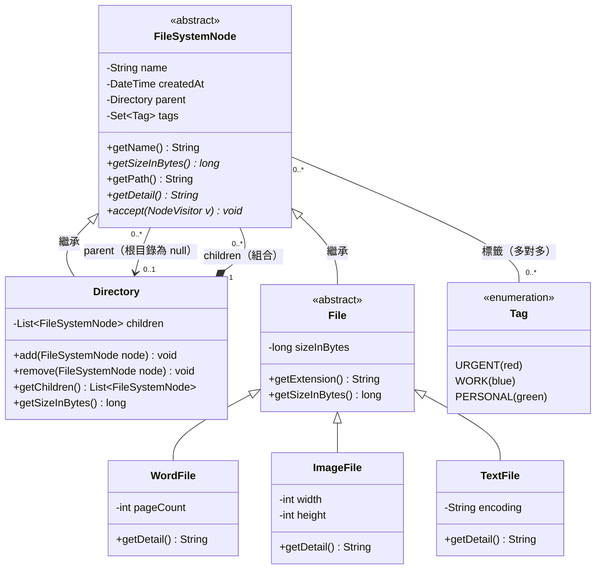
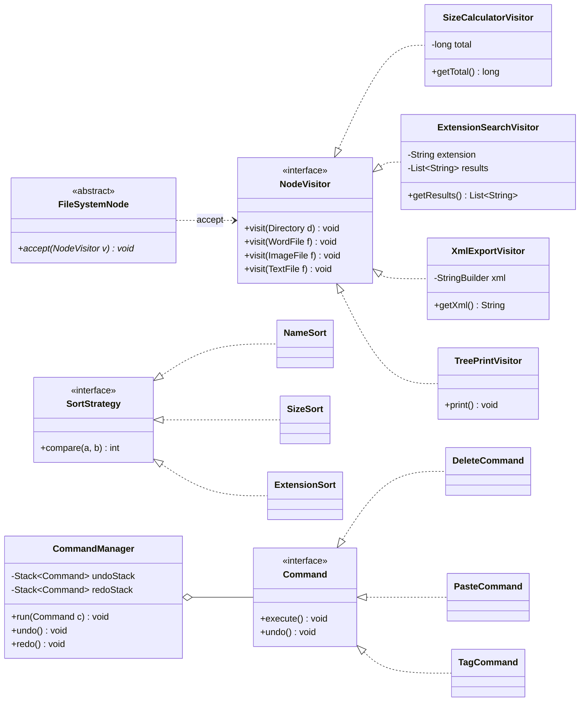
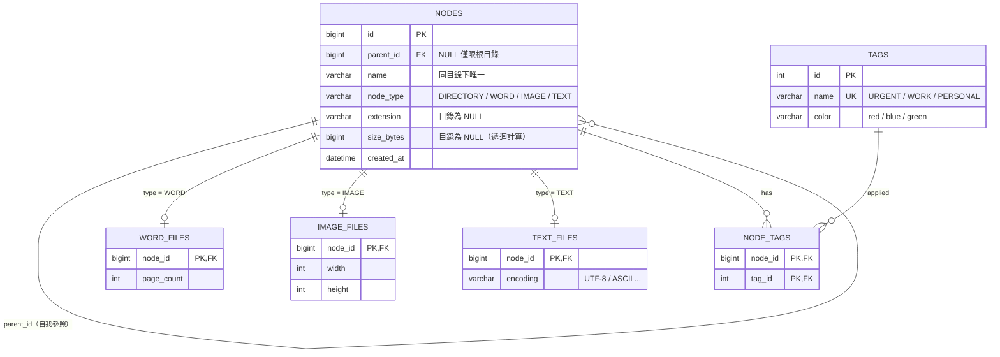

# 雲端檔案管理系統：UML 與 ER 設計

> 圖表使用 Mermaid 語法，貼進 GitHub README 即可直接渲染。

---

## 1. UML 類別圖（Domain Model）



### 設計說明

| 決策 | 理由 |
|---|---|
| `FileSystemNode` 為抽象父類別 | 檔案與目錄皆有名稱、建立時間、大小，可統一處理（Composite Pattern） |
| `Directory` 與 `FileSystemNode` 為**組合（實心菱形）** | 目錄刪除時其下所有節點一併消失；且允許無限層級巢狀 |
| `parent` 必填（根目錄除外） | 對應「檔案不可孤立存在於目錄之外」的業務規則 |
| 目錄的大小不存值，由 `getSizeInBytes()` **遞迴計算** | 避免資料不一致，且是題目要求的核心邏輯 |
| 大小統一用 **Byte** 儲存 | 範例混用 B / KB / MB，內部統一再於輸出時格式化 |
| `Tag` 為多對多 | 題目要求「支援多重標籤」 |

---

## 2. 設計模式層（延伸類別圖）

> 領域模型之上，加入實作功能所需的模式：**Visitor**（操作）、**Strategy**（排序）、**Command**（Undo/Redo）。



---

## 3. ER Model（資料庫 Schema）



### Schema 設計說明

| 議題 | 作法 |
|---|---|
| **無限層級** | `nodes.parent_id` 自我參照；查詢子樹用 Recursive CTE |
| **檔案不可孤立** | 非根節點 `parent_id NOT NULL`（以 CHECK 或應用層保證，僅一筆根目錄可為 NULL） |
| **子類型資料** | 採 **Class Table Inheritance**：共同欄位放 `nodes`，專屬欄位放獨立子表，避免大量 NULL 欄位，新增檔案類型只需加表 |
| **目錄大小** | 不落庫，以遞迴查詢或應用層計算，避免子檔案變動後需同步更新 |
| **多重標籤** | `node_tags` 關聯表，複合主鍵 `(node_id, tag_id)` |
| **刪除行為** | `parent_id` 與子表 FK 設 `ON DELETE CASCADE`，對應 UML 的組合關係 |

### 參考 DDL（SQLite / PostgreSQL 皆可微調使用）

```sql
CREATE TABLE nodes (
    id          BIGINT PRIMARY KEY,
    parent_id   BIGINT REFERENCES nodes(id) ON DELETE CASCADE,
    name        VARCHAR(255) NOT NULL,
    node_type   VARCHAR(20)  NOT NULL
                CHECK (node_type IN ('DIRECTORY','WORD','IMAGE','TEXT')),
    extension   VARCHAR(10),
    size_bytes  BIGINT CHECK (size_bytes >= 0),
    created_at  TIMESTAMP NOT NULL,
    UNIQUE (parent_id, name),
    -- 檔案一定要有大小；目錄不存大小
    CHECK ((node_type = 'DIRECTORY' AND size_bytes IS NULL)
        OR (node_type <> 'DIRECTORY' AND size_bytes IS NOT NULL))
);

CREATE TABLE word_files (
    node_id    BIGINT PRIMARY KEY REFERENCES nodes(id) ON DELETE CASCADE,
    page_count INT NOT NULL CHECK (page_count > 0)
);

CREATE TABLE image_files (
    node_id BIGINT PRIMARY KEY REFERENCES nodes(id) ON DELETE CASCADE,
    width   INT NOT NULL CHECK (width > 0),
    height  INT NOT NULL CHECK (height > 0)
);

CREATE TABLE text_files (
    node_id  BIGINT PRIMARY KEY REFERENCES nodes(id) ON DELETE CASCADE,
    encoding VARCHAR(20) NOT NULL
);

CREATE TABLE tags (
    id    INT PRIMARY KEY,
    name  VARCHAR(30) NOT NULL UNIQUE,
    color VARCHAR(20) NOT NULL
);

CREATE TABLE node_tags (
    node_id BIGINT NOT NULL REFERENCES nodes(id) ON DELETE CASCADE,
    tag_id  INT    NOT NULL REFERENCES tags(id),
    PRIMARY KEY (node_id, tag_id)
);

INSERT INTO tags VALUES (1,'URGENT','red'), (2,'WORK','blue'), (3,'PERSONAL','green');
```

### 遞迴查詢範例：計算某目錄總大小

```sql
WITH RECURSIVE subtree AS (
    SELECT id, size_bytes FROM nodes WHERE id = :directory_id
    UNION ALL
    SELECT n.id, n.size_bytes
    FROM nodes n JOIN subtree s ON n.parent_id = s.id
)
SELECT COALESCE(SUM(size_bytes), 0) AS total_bytes FROM subtree;
```
